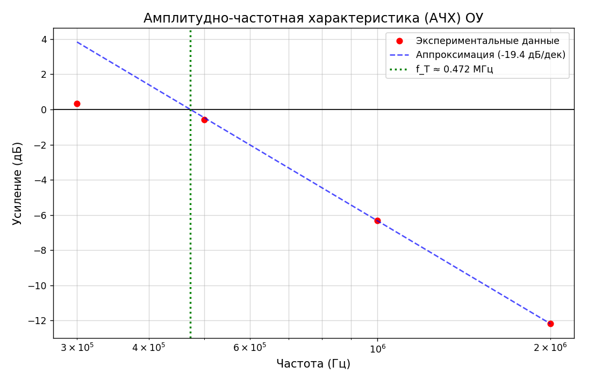

# Automatic Study of Quadripoles (Op-Amp Characteristics)
Программный комплекс для автоматизации лабораторных измерений характеристик операционных усилителей. Проект позволяет управлять генератором сигналов и осциллографом для автоматического построения графиков Боде (ЛАЧХ) и определения частоты единичного усиления ($f_T$).

## Оборудование
Проект поддерживает работу с приборами по протоколу VISA (USB-TMC):
* Четырёхканальный осциллограф OWON XDS3064E.
* Генератор: UTG900E.

## Возможности
* Автоматический проход по заданному списку частот для замера коэффициента усиления.  
* Smart Scaling: автоматическая подстройка вертикальной и горизонтальной развертки осциллографа для максимизации точности АЦП.  
* Математическая обработка: расчет наклона АЧХ и аппроксимация частоты единичного усиления $f_T$.  
* Логирование: полная запись хода эксперимента в файлы .log с указанием всех SCPI-команд.

## Быстрый старт
### Подготовка окружения
Убедитесь, что у Вас установлены NI-VISA или Keysight VISA драйверы (необходим файл visa32.dll в системной папке).
Склонируйте репозиторий:
`git clone https://github.com/Anfisa111/automated-operational-amplifier-testing.git`  

Создайте виртуальное окружение:
`python -m venv venv`  
`Set-ExecutionPolicy -Scope CurrentUser -ExecutionPolicy Bypass`  
`.venv\Scripts\activate`  
`cd automated-operational-amplifier-testing`  
### Подключение приборов и настройка конфигурационного файла
1. Подключите приборы через USB-кабель к Вашему ПК.  
2. Запустите утилиту NI MAX.  
3. В левой панели раскройте список Devices and Interfaces.  
4. Найдите Ваши приборы. Они будут иметь формат VISA Resource Name, например:    
    * "USB0::0x6656::0x0834::AWG1224500035::INSTR"    
    * "USB0::0x5345::0x1235::24410233::INSTR"   
    
5. Скопируйте VISA Resource Name и вставьте в соответствующие поля конфигурационного файла:  
    * generator_addr = "адрес_генератора"  
    * scope_addr = "адрес_осциллографа"  

### Установка зависимостей
`pip install -r requirements.txt`

### Структура проекта
instruments/ — драйверы для генератора и осциллографа.  
calculation/ — алгоритмы обработки данных и расчета $f_T$.   
plotting/ — модули для визуализации графиков Боде.   
scripts/op_test1.py — основной скрипт проведения эксперимента.  
logs/ — логи.  
docs/ — документация к приборам (генератор и осциллограф).  
configs/ — конфигурационные файлы.  
utils/ — вспомогательные функции.  
tests/ - тесты.

### Запуск
Подключите приборы по USB и запустите основной скрипт из корня проекта:  
`python -m scripts.op_test1.py` 

## Пример вывода
После завершения цикла измерений программа построит график и выведет отчет:  
Частота единичного усиления $f_T$: 0.472 МГц.  
Доверительный интервал [0,272; 0.672].  
Наклон АЧХ: -19.4 дБ/дек.  

  

